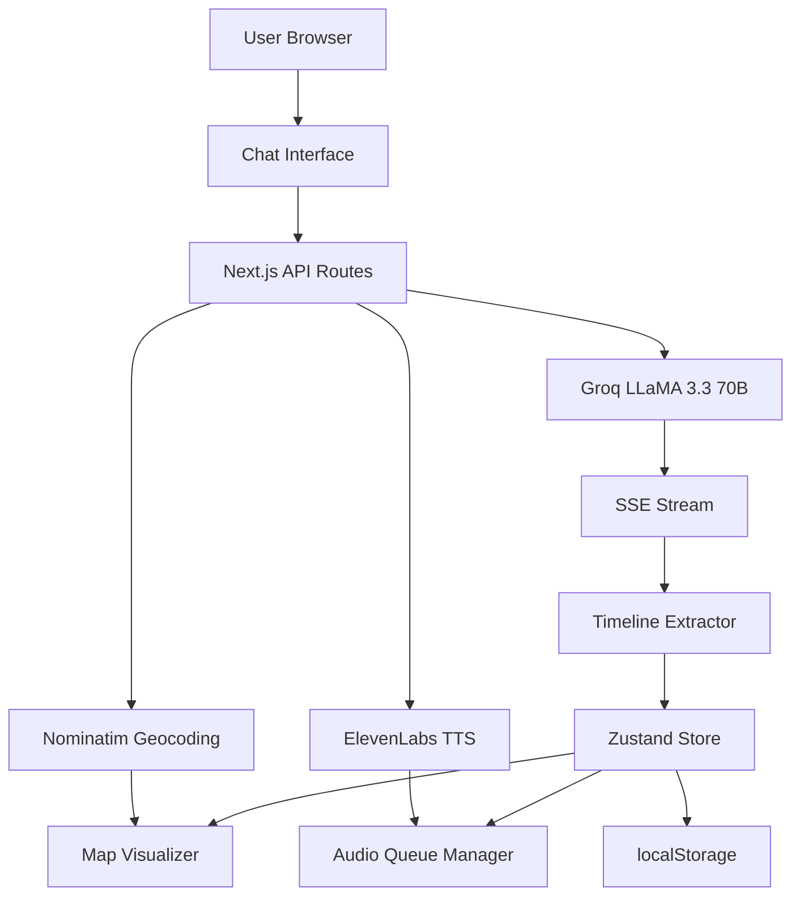
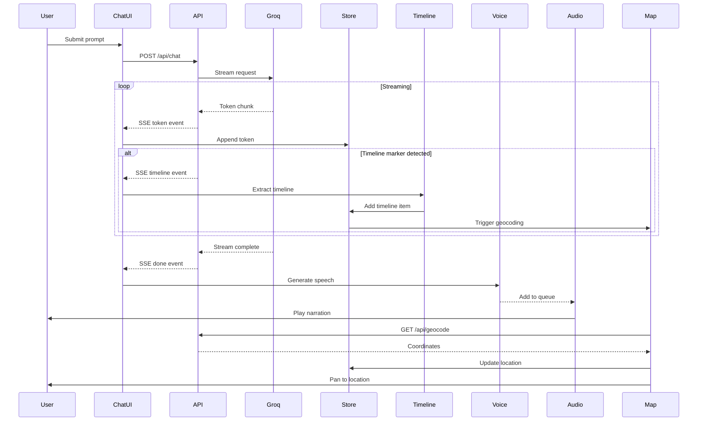

# Design Document

## Overview

Hauntify is a sophisticated full-stack Next.js 15+ application that orchestrates multiple complex systems into a cohesive horror storytelling experience. The architecture follows a streaming-first approach where AI-generated content flows through a multi-stage pipeline: text generation → timeline extraction → voice synthesis → audio playback, all while synchronizing with an interactive map visualization.

The application uses a client-server architecture with Next.js App Router, implementing Server-Sent Events for real-time streaming, Zustand for client-side state management with localStorage persistence, and a custom audio queue manager for seamless narration playback.

## Architecture

### High-Level Architecture



### System Components

1. **Frontend Layer** (React 19 + Next.js 15)
   - Chat Interface: User input, message display, timeline cards
   - Map Visualizer: Leaflet-based interactive map with markers and paths
   - Audio Player: Custom HTML5 Audio-based playback controls
   - State Management: Zustand store with localStorage persistence

2. **API Layer** (Next.js API Routes)
   - `/api/chat`: Streaming chat endpoint with SSE
   - `/api/voice`: Voice synthesis endpoint (ElevenLabs/Web Speech)
   - `/api/geocode`: Location geocoding endpoint (Nominatim)

3. **Service Layer** (Server-side utilities)
   - Groq Chat: AI story generation with streaming
   - Timeline Extractor: Parse and extract timeline markers
   - Geocoding Service: Rate-limited location lookup with caching
   - Error Handler: Centralized logging and error management

4. **External Services**
   - Groq API: LLaMA 3.3 70B for story generation
   - ElevenLabs API: Text-to-speech with Brian voice
   - Nominatim API: OpenStreetMap geocoding
   - OpenStreetMap: Map tiles for Leaflet

### Data Flow



## Components and Interfaces

### 1. Chat Interface Component

**Purpose**: Main user interaction point for submitting prompts and viewing generated stories.

**Key Features**:
- Message input with 2000 character limit validation
- Real-time streaming message display
- Timeline card rendering with vertical timeline layout
- Loading states with animated dots
- Auto-scroll to latest message

**Props**:
```typescript
interface ChatInterfaceProps {
  className?: string;
}
```

**State Management**:
- Uses `useChatStream` hook for streaming logic
- Accesses Zustand store for messages and streaming state
- Manages local input state and validation

**Styling**:
- Dark background (#1A1A1A for user, #1a1919 for assistant)
- Orange accents for interactive elements
- Vertical timeline with connecting lines
- Gradient backgrounds with glow effects on hover

### 2. Map Visualizer Component

**Purpose**: Display interactive map with story locations and animated markers.

**Key Features**:
- Leaflet integration with OpenStreetMap tiles
- Custom markers with pulse animations
- Polyline path connecting locations
- Popup tooltips with location details
- Auto-panning to new locations

**Props**:
```typescript
interface MapVisualizerProps {
  center: [number, number];
  zoom: number;
  locations: TimelineItem[];
  onLocationClick?: (item: TimelineItem) => void;
}
```

**Implementation Details**:
- Dynamic import with `ssr: false` to avoid SSR issues
- Uses `useMapSync` hook for coordinate updates
- Validates coordinates before panning
- Maintains location history for path rendering

### 3. Audio Queue Manager

**Purpose**: Manage audio playback queue with play/pause/seek/volume controls.

**Architecture**:
```typescript
class AudioQueueManager {
  private audio: HTMLAudioElement;
  private queue: AudioQueueItem[];
  private currentIndex: number;
  private listeners: Set<StateListener>;
  
  // Public methods
  addToQueue(item: AudioQueueItem): void;
  play(index?: number): Promise<void>;
  pause(): void;
  resume(): void;
  playNext(): void;
  playPrevious(): void;
  seek(time: number): void;
  setVolume(volume: number): void;
  clearQueue(): void;
  
  // Private methods
  private notifyTimeUpdate(): void;
  private handleError(error: Error): void;
  private getSegmentOffset(): number;
  private getOverallProgress(): number;
}
```

**Key Features**:
- Deduplication by audio ID
- Auto-advance on segment end
- Real-time progress tracking
- Error handling with skip-to-next logic
- Blob URL cleanup to prevent memory leaks

### 4. Zustand State Store

**Purpose**: Centralized state management with persistence.

**Store Schema**:
```typescript
interface ChatStore {
  // Messages
  messages: ChatMessage[];
  addMessage: (message: ChatMessage) => void;
  updateLastMessage: (content: string) => void;
  addTimelineToLastMessage: (timeline: TimelineItem) => void;
  
  // Streaming
  isStreaming: boolean;
  setIsStreaming: (streaming: boolean) => void;
  
  // Audio
  audioQueue: AudioQueueItem[];
  addToAudioQueue: (item: AudioQueueItem) => void;
  clearAudioQueue: () => void;
  
  // Location
  locationHistory: TimelineItem[];
  activeLocation: TimelineItem | null;
  addLocation: (location: TimelineItem) => void;
  setActiveLocation: (location: TimelineItem | null) => void;
  
  // Session
  sessionId: string;
  loadSession: (sessionId: string) => void;
  clearSession: () => void;
}
```

**Persistence Strategy**:
- Save to localStorage on every state change
- Debounce saves to avoid performance issues
- Serialize messages and timeline data
- Restore on mount with session ID

### 5. Timeline Extractor

**Purpose**: Parse AI-generated text for timeline markers and extract structured data.

**Algorithm**:
```typescript
function extractTimeline(text: string): TimelineItem[] {
  const markers: TimelineItem[] = [];
  const regex = /##TIMELINE##\s*(\{[^}]+\})/g;
  
  let match;
  while ((match = regex.exec(text)) !== null) {
    try {
      const json = parseWithBraceCounting(match[1]);
      const validated = TimelineItemSchema.parse(json);
      markers.push(validated);
    } catch (error) {
      // Log and continue
    }
  }
  
  return deduplicateByYearTitle(markers);
}
```

**Brace-Counting Parser**:
- Handles incomplete JSON markers
- Counts opening/closing braces
- Extracts complete JSON objects
- Validates with Zod schema

### 6. Geocoding Service

**Purpose**: Convert location names to coordinates with rate limiting and caching.

**Implementation**:
```typescript
class GeocodingService {
  private cache: Map<string, GeocodingResult>;
  private queue: Promise<any>;
  private lastRequestTime: number;
  
  async geocode(place: string): Promise<GeocodingResult> {
    // Check cache
    if (this.cache.has(place)) {
      return this.cache.get(place)!;
    }
    
    // Rate limit (1 req/sec)
    await this.waitForRateLimit();
    
    // Fetch from Nominatim
    const result = await this.fetchNominatim(place);
    
    // Validate coordinates
    if (!this.isValidCoordinate(result.lat, result.lon)) {
      throw new Error('Invalid coordinates');
    }
    
    // Cache result
    this.cache.set(place, result);
    
    return result;
  }
  
  private async waitForRateLimit(): Promise<void> {
    const elapsed = Date.now() - this.lastRequestTime;
    if (elapsed < 1000) {
      await new Promise(resolve => setTimeout(resolve, 1000 - elapsed));
    }
    this.lastRequestTime = Date.now();
  }
}
```

**Caching Strategy**:
- In-memory cache with 30-day TTL
- Key: normalized place name
- Value: {name, lat, lon, country}

## Data Models

### ChatMessage

```typescript
interface ChatMessage {
  id: string;
  role: 'user' | 'assistant';
  content: string;
  timestamp: number;
  timelineItems?: TimelineItem[];
}
```

### TimelineItem

```typescript
interface TimelineItem {
  year: number;
  title: string;
  desc: string;
  place: string;
  lat?: number;
  lon?: number;
}
```

### AudioQueueItem

```typescript
interface AudioQueueItem {
  id: string;
  blobUrl: string;
  duration: number;
  text: string;
}
```

### ChatSession

```typescript
interface ChatSession {
  id: string;
  messages: ChatMessage[];
  locationHistory: TimelineItem[];
  createdAt: number;
  updatedAt: number;
}
```

## Error Handling

### Error Categories

1. **API Errors**
   - Groq API failures (network, rate limit, quota)
   - ElevenLabs API failures (quota exceeded, invalid key)
   - Nominatim API failures (rate limit, invalid location)

2. **Client Errors**
   - Invalid user input (too long, empty)
   - Audio playback errors (unsupported format, decode error)
   - Geocoding failures (invalid coordinates, not found)

3. **System Errors**
   - localStorage quota exceeded
   - Memory leaks from blob URLs
   - Stream parsing errors

### Error Handling Strategy

```typescript
class ErrorHandler {
  static log(message: string, severity: 'info' | 'warn' | 'error', context?: any): void {
    const prefix = severity === 'error' ? '❌' : severity === 'warn' ? '⚠️' : 'ℹ️';
    console[severity](`${prefix} ${message}`, context);
  }
  
  static handleApiError(error: any, service: string): void {
    if (error.status === 429) {
      toast.error(`${service} rate limit exceeded. Please wait and try again.`);
    } else if (error.status === 401) {
      toast.error(`${service} API key invalid or missing.`);
    } else {
      toast.error(`${service} error: ${error.message}`);
    }
    
    this.log(`${service} API error`, 'error', error);
  }
}
```

### User-Facing Error Messages

- **Groq API Error**: "Story generation failed. Please try again."
- **ElevenLabs Quota**: "Voice quota exceeded. Using browser voice instead."
- **Geocoding Failed**: "Location not found. Timeline will display without map marker."
- **Audio Playback Error**: "Audio playback failed. Skipping to next segment."

## Testing Strategy

### Unit Tests

1. **Timeline Extraction**
   - Test brace-counting parser with incomplete JSON
   - Test deduplication logic
   - Test Zod validation

2. **Audio Queue Manager**
   - Test queue operations (add, remove, clear)
   - Test playback state transitions
   - Test error handling and recovery

3. **Geocoding Service**
   - Test rate limiting logic
   - Test cache hit/miss scenarios
   - Test coordinate validation

### Integration Tests

1. **Streaming Pipeline**
   - Test end-to-end story generation
   - Test timeline extraction during streaming
   - Test voice generation trigger

2. **Map Synchronization**
   - Test geocoding trigger on timeline event
   - Test map panning to new location
   - Test polyline path rendering

3. **Audio Playback**
   - Test queue auto-advance
   - Test seek functionality
   - Test volume control

### End-to-End Tests

1. **Complete User Flow**
   - Submit prompt → receive story → hear narration → see map update
   - Test session persistence and restoration
   - Test responsive layout on different screen sizes

2. **Error Scenarios**
   - Test API key missing fallback
   - Test quota exceeded handling
   - Test network error recovery

### Manual Testing Checklist

- [ ] Desktop layout (1024px+): 60/40 split
- [ ] Tablet layout (768-1023px): 50/50 split
- [ ] Mobile layout (<768px): Tabbed interface
- [ ] Audio player controls: play/pause/seek/volume
- [ ] Map markers: click for popup, animated pulse
- [ ] Timeline cards: hover glow effect
- [ ] Voice narration: natural speech without brackets
- [ ] Session persistence: reload page and restore state
