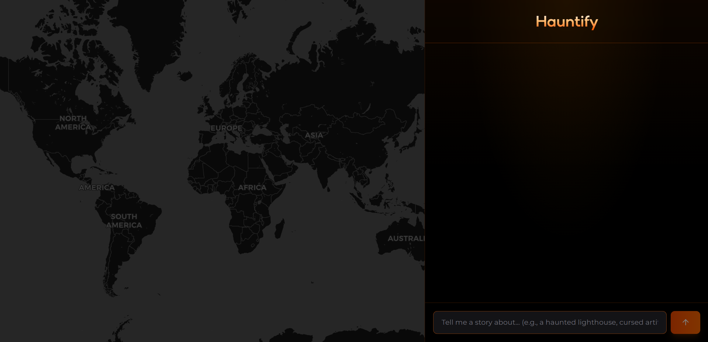
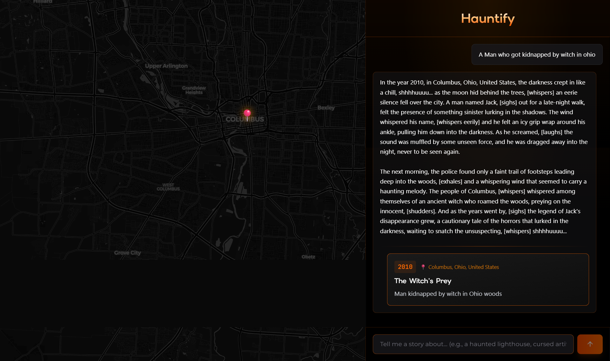

<div align="center">

# 🎃 Hauntify 👻

### *AI-Powered Horror Storytelling with Real-Time Map Visualization*

<p align="center">
  
  
</p>

<p align="center">
  
  
  
  
  
</p>

<p align="center">
  <a href="#-demo">Demo</a> •
  <a href="#-features">Features</a> •
  <a href="#-quick-start">Quick Start</a> •
  <a href="#-how-it-works">How It Works</a> •
  <a href="#-contributing">Contributing</a>
</p>

---

<p align="center">
  <strong>🏆 Built for the Kiro Launch Hackathon</strong><br>
  <em>Showcasing spec-driven development with Kiro IDE's AI-powered workflow</em>
</p>

</div>

## 📖 About

**Hauntify** transforms simple prompts into immersive horror experiences. Type a fear, and watch as AI crafts a terrifying narrative—narrated by dramatic voice synthesis, visualized on an interactive map, and displayed on a dynamic timeline.

> **🤖 Developed with [Kiro IDE](https://kiro.ai)** — This project demonstrates Kiro's spec-driven development approach, where AI assists in transforming requirements into production-ready code through intelligent code generation and real-time assistance.

## 🎬 Demo

<div align="center">

[](https://youtu.be/mZdsxvG-2O0)

**[🔗 Live Demo](https://hauntify.vercel.app)** • **[📺 Video Walkthrough](https://youtu.be/mZdsxvG-2O0)** • **[🐦 Twitter/X Post](https://x.com/doodle_jaxkarth/status/1996883028413739178)**

</div>

### Screenshots

<div align="center">

| Landing Page | Story Generation | Map Visualization |
|:---:|:---:|:---:|
|  |  |  |
| Dark horror-themed landing | Real-time AI streaming | Interactive location markers |

</div>

## ✨ Features

<table>
<tr>
<td width="50%">

### 🤖 AI-Powered Storytelling
- **2-Stage Quality Pipeline** — Groq LLaMA 3.3 70B generates stories, GPT-OSS-120B ensures quality
- **Real-time Streaming** — Watch stories unfold token-by-token
- **Quality Gate** — Stories scored 1-10; enhanced if below threshold

</td>
<td width="50%">

### 🎙️ Voice Narration
- **ElevenLabs Integration** — Professional AI voice synthesis
- **4 Voice Types** — Narrator, Villain, Ghost, Historian
- **Web Speech Fallback** — Works without API key

</td>
</tr>
<tr>
<td width="50%">

### 🗺️ Interactive Map
- **Live Location Sync** — Places mentioned appear on map instantly
- **Animated Markers** — Orange-glow horror aesthetic
- **Auto-Geocoding** — Nominatim API with 30-day cache

</td>
<td width="50%">

### 📜 Timeline Visualization
- **Inline Event Cards** — Historical events extracted automatically
- **Vertical Timeline** — Connected with visual lines
- **Clickable Navigation** — Jump to events on map

</td>
</tr>
<tr>
<td width="50%">

### 🎵 Audio Player
- **Full Controls** — Play/pause, skip, scrub, volume
- **Queue Management** — Continuous playback
- **Session Persistence** — Audio saved to localStorage

</td>
<td width="50%">

### 📱 Responsive Design
- **Desktop** — 60/40 split-screen layout
- **Tablet** — 50/50 adaptive split
- **Mobile** — Tabbed interface navigation

</td>
</tr>
</table>

## 🛠️ Tech Stack

<table>
<tr>
<td><strong>Frontend</strong></td>
<td>Next.js 16, React 19, TypeScript 5, Tailwind CSS v4, Zustand</td>
</tr>
<tr>
<td><strong>AI/ML</strong></td>
<td>Groq API (LLaMA 3.3 70B + GPT-OSS-120B), ElevenLabs TTS</td>
</tr>
<tr>
<td><strong>Maps</strong></td>
<td>Leaflet, OpenStreetMap, Nominatim Geocoding</td>
</tr>
<tr>
<td><strong>Validation</strong></td>
<td>Zod schemas, TypeScript strict mode</td>
</tr>
<tr>
<td><strong>Streaming</strong></td>
<td>Server-Sent Events (SSE), NDJSON format</td>
</tr>
</table>

## 🚀 Quick Start

### Prerequisites

- Node.js 20.9+ (required by Next.js 16)
- npm or pnpm 10
- [Groq API Key](https://console.groq.com) (free)
- [ElevenLabs API Key](https://elevenlabs.io) (optional, free tier available)

### Installation

```bash
# Clone the repository
git clone https://github.com/parthchilwerwar/Hauntify.git
cd Hauntify

# Install dependencies
npm ci
# Or, with pnpm 10:
# pnpm install --frozen-lockfile

# Set up environment variables
cp .env.example .env.local
```

### Environment Variables

Create `.env.local` with:

```env
# Required - Get free key at https://console.groq.com
GROQ_API_KEY=gsk_your_key_here

# Optional - Get free key at https://elevenlabs.io (10k chars/month free)
# Without this, app falls back to browser's Web Speech API
ELEVENLABS_API_KEY=your_elevenlabs_key
```

### Run Development Server

```bash
npm run dev
```

Open [http://localhost:3000](http://localhost:3000) 🎃

### Local Checks

```bash
npm run lint
npm run typecheck
npm test
npm run build
```

The unit tests mock external requests and do not need API keys. `npm run test:api`
is a separate integration check that requires a running server and configured API keys.
When updating dependencies, update `package-lock.json` and regenerate `pnpm-lock.yaml`
with `pnpm import` so both supported installation paths use the same versions.

## 🏗️ Architecture

### System Overview

```
┌─────────────────────────────────────────────────────────────────────────────┐
│                              HAUNTIFY ARCHITECTURE                          │
├─────────────────────────────────────────────────────────────────────────────┤
│                                                                             │
│  ┌─────────────┐     ┌──────────────────────────────────────────────────┐  │
│  │   Client    │     │              Next.js API Routes                  │  │
│  │   (React)   │────▶│  /api/chat ──▶ 2-Stage AI Pipeline              │  │
│  │             │     │  /api/voice ─▶ ElevenLabs TTS                   │  │
│  │  • Chat UI  │◀────│  /api/geocode ▶ Nominatim Geocoding             │  │
│  │  • Map      │     └──────────────────────────────────────────────────┘  │
│  │  • Audio    │                           │                               │
│  │  • Timeline │                           ▼                               │
│  └─────────────┘     ┌──────────────────────────────────────────────────┐  │
│         │            │              External Services                    │  │
│         │            │  • Groq API (LLaMA 3.3 70B + GPT-OSS-120B)       │  │
│         ▼            │  • ElevenLabs (Voice Synthesis)                  │  │
│  ┌─────────────┐     │  • OpenStreetMap (Maps + Geocoding)              │  │
│  │  Zustand    │     └──────────────────────────────────────────────────┘  │
│  │  + localStorage                                                         │
│  └─────────────┘                                                           │
└─────────────────────────────────────────────────────────────────────────────┘
```

### 2-Stage AI Pipeline

```
User Prompt
     │
     ▼
┌────────────────────────────┐
│  Stage 1: Story Generation │
│  Groq LLaMA 3.3 70B        │
│  • Fast, creative output   │
│  • 140-170 words/paragraph │
│  • Timeline markers        │
└────────────┬───────────────┘
             │
             ▼
┌────────────────────────────┐
│  Stage 2: Quality Gate     │
│  Groq GPT-OSS-120B         │
│  • Scores 1-10             │
│  • Score ≥7: Pass through  │
│  • Score <7: Enhance       │
└────────────┬───────────────┘
             │
             ▼
    Enhanced Story + Audio
```

## 🎯 How Kiro Was Used

This project showcases **spec-driven development** with Kiro IDE:

### 📋 Requirements → Implementation

```
.kiro/
├── specs/
│   └── hauntify-horror-storytelling/
│       ├── requirements.md    # 14+ formal requirements with acceptance criteria
│       ├── tasks.md           # 25+ implementation tasks linked to requirements
│       └── design.md          # Architecture diagrams (Mermaid)
└── steering/
    ├── product.md             # Product vision and user flows
    ├── tech.md                # Technology decisions and patterns
    └── structure.md           # Project structure guidelines
```

### 🔄 Kiro Development Workflow

1. **Spec Creation** — Defined requirements with acceptance criteria in `.kiro/specs/`
2. **Task Generation** — Kiro generated implementation tasks from requirements
3. **Code Generation** — AI-assisted implementation following specs
4. **Steering Docs** — Maintained consistency with product/tech guidelines
5. **Iterative Refinement** — Updated specs as features evolved

### 📊 Spec Coverage

| Requirement | Description | Status |
|-------------|-------------|--------|
| AI Story Generation | Groq streaming with system prompts | ✅ |
| Real-Time Streaming | SSE/NDJSON pipeline | ✅ |
| Voice Narration | ElevenLabs + Web Speech fallback | ✅ |
| Audio Queue | Custom AudioQueueManager | ✅ |
| Timeline Extraction | Regex parsing + Zod validation | ✅ |
| Geocoding | Nominatim with rate limiting | ✅ |
| Map Visualization | Leaflet with animated markers | ✅ |
| Session Persistence | Zustand + localStorage | ✅ |
| Mobile Responsive | Tabbed interface | ✅ |

## 📁 Project Structure

```
hauntify/
├── 📂 .kiro/                      # Kiro specs and steering docs
│   ├── specs/                     # Requirements & implementation tasks
│   └── steering/                  # Product, tech, structure guidelines
├── 📂 app/                        # Next.js App Router
│   ├── api/
│   │   ├── chat/route.ts          # 2-Stage AI streaming endpoint
│   │   ├── voice/route.ts         # ElevenLabs TTS endpoint
│   │   └── geocode/route.ts       # Nominatim geocoding
│   ├── dashboard/page.tsx         # Main app (split-screen)
│   └── page.tsx                   # Landing page
├── 📂 components/
│   ├── chat/                      # Chat UI components
│   ├── map/                       # Map visualization
│   └── ui/                        # shadcn/ui components
├── 📂 src/
│   ├── hooks/                     # React hooks
│   ├── server/                    # Server-side utilities
│   │   ├── groqChat.ts            # Groq API integration
│   │   ├── enhancedPipeline.ts    # 2-stage orchestration
│   │   └── storyEnhancer.ts       # Quality gate logic
│   ├── services/                  # Client services
│   ├── store/                     # Zustand state
│   └── types/                     # TypeScript definitions
└── 📄 package.json
```

## 📡 API Reference

<details>
<summary><strong>POST /api/chat</strong> — AI Story Generation</summary>

**2-Stage Pipeline** powered by Groq API.

**Request:**
```json
{
  "messages": [
    {"role": "user", "content": "Tell me about a cursed town"}
  ]
}
```

**Response (NDJSON stream):**
```json
{"type":"token","data":"In the year 1692..."}
{"type":"timeline","data":{"year":1692,"title":"The Trials","place":"Salem, MA"}}
{"type":"done","data":null}
```
</details>

<details>
<summary><strong>POST /api/voice</strong> — Text-to-Speech</summary>

**Request:**
```json
{
  "text": "The cursed town...",
  "voice_type": "narrator"
}
```

**Response:** `audio/mpeg` (MP3 file)

**Voice Types:** `narrator`, `villain`, `ghost`, `historian`
</details>

<details>
<summary><strong>GET /api/geocode</strong> — Location Lookup</summary>

**Request:** `GET /api/geocode?q=Salem,Massachusetts`

**Response:**
```json
{
  "name": "Salem, Essex County, Massachusetts, USA",
  "lat": 42.5195,
  "lon": -70.8967
}
```
</details>

## 💰 Cost & Rate Limits

| Service | Free Tier | Cost per Story | Notes |
|---------|-----------|----------------|-------|
| **Groq API** | ✅ Free | ~$0.0015 | LLaMA + GPT combined |
| **ElevenLabs** | 10k chars/mo | ~$0.0005 | Optional (Web Speech fallback) |
| **Nominatim** | ✅ Free | $0 | 1 req/sec rate limit |
| **OpenStreetMap** | ✅ Free | $0 | Fair use policy |

**Total Cost:** ~$0.002 per story (~500 stories per $1)

## 🤝 Contributing

Contributions are welcome! This project follows standard open-source practices.

### Getting Started

1. **Fork** the repository
2. **Clone** your fork: `git clone https://github.com/YOUR_USERNAME/Hauntify.git`
3. **Create branch**: `git checkout -b feature/amazing-feature`
4. **Make changes** and test locally
5. **Commit**: `git commit -m 'Add amazing feature'`
6. **Push**: `git push origin feature/amazing-feature`
7. **Open PR** against `main` branch

### Development Guidelines

- Follow existing code style (TypeScript strict mode)
- Add Zod validation for new API endpoints
- Update `.kiro/specs/` if adding new features
- Test on mobile (tabbed interface)
- Keep commits focused and descriptive

### Areas for Contribution

- 🌐 **Internationalization** — Add more language support
- 🎨 **Themes** — Light mode, custom themes
- 🔊 **Audio** — More voice options, background music
- 🗺️ **Maps** — Custom markers, heatmaps
- 📊 **Analytics** — Usage tracking, story insights
- ♿ **Accessibility** — Screen reader support, keyboard nav

## 🚀 Deployment

### Vercel (Recommended)

[](https://vercel.com/new/clone?repository-url=https://github.com/parthchilwerwar/Hauntify&env=GROQ_API_KEY,ELEVENLABS_API_KEY)

1. Click button above or import from GitHub
2. Add environment variables:
   - `GROQ_API_KEY` (required)
   - `ELEVENLABS_API_KEY` (optional)
3. Deploy!

### Other Platforms

Works on any platform supporting:
- Next.js 16+ App Router
- Node.js runtime (for SSE streaming)
- Environment variables

Tested on: **Vercel**, **Railway**, **Render**

## 📜 License

This project is licensed under the **MIT License** — see the [LICENSE](LICENSE) file for details.

```
MIT License - Free to use, modify, and distribute
```

## 🙏 Acknowledgments

- **[Kiro IDE](https://kiro.ai)** — AI-powered development environment
- **[Groq](https://groq.com)** — Ultra-fast LLM inference
- **[ElevenLabs](https://elevenlabs.io)** — Voice synthesis API
- **[OpenStreetMap](https://openstreetmap.org)** — Map tiles & geocoding
- **[shadcn/ui](https://ui.shadcn.com)** — Beautiful UI components

---

<div align="center">

**Built with 🎃 for the [Kiro Launch Hackathon](https://kiro.ai)**

<p>
  <a href="https://github.com/parthchilwerwar/Hauntify/stargazers">⭐ Star this repo</a> •
  <a href="https://github.com/parthchilwerwar/Hauntify/issues">🐛 Report Bug</a> •
  <a href="https://github.com/parthchilwerwar/Hauntify/issues">💡 Request Feature</a>
</p>

<sub>Made by <a href="https://github.com/parthchilwerwar">@parthchilwerwar</a></sub>

</div>
